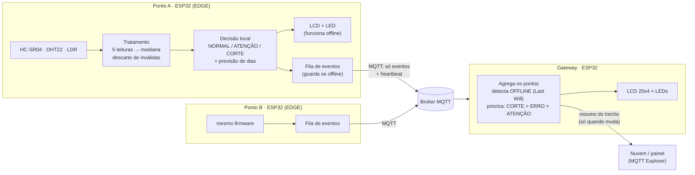

# Sistema Edge Integrado para Monitoramento de Vegetação

Sprint 03: evolução da PoC (um ESP32) para um **sistema Edge distribuído** com vários pontos de monitoramento ao longo da rodovia e um gateway.

```
Sensor → Nó Edge → Processamento Local → Comunicação → Resultado
```

| Dispositivo | Pasta | Papel |
|---|---|---|
| Ponto A (ESP32) | [`no_sensor/`](no_sensor/) com `NODE_ID "A"` | Mede, trata, decide e avisa |
| Ponto B (ESP32) | [`no_sensor/`](no_sensor/) com `NODE_ID "B"` | Mesmo firmware, outro ponto da rodovia |
| Gateway (ESP32) | [`gateway/`](gateway/) | Agrega os pontos, detecta falhas e prioriza o trecho |

Video demonstrativo

[](https://youtu.be/U1Gvs2vLDC8)

Simulação no Wokwi: _(colar aqui os links dos 3 projetos)_
- [Ponto A/B](https://wokwi.com/projects/475536198822428673)
- [Gateway](https://wokwi.com/projects/475537358678725633)

---

## 1. Arquitetura



**Onde cada processamento acontece**

| Local | Processamento |
|---|---|
| **Nó (Edge)** | Leitura dos sensores, mediana, descarte de leituras inválidas, detecção de sensor com defeito, classificação com histerese, previsão de dias até o corte, decisão de **quando** transmitir e fila offline |
| **Gateway** | Consolida os pontos, detecta pontos fora do ar e perda de eventos, define a prioridade do trecho e alerta localmente |
| **Nuvem** | Apenas visualiza o resumo. **Nenhuma decisão depende dela.** |

**Por que 2 nós + 1 gateway:** uma rodovia tem vários pontos de monitoramento, e cada ponto precisa decidir sozinho porque pode ficar sem conexão. O gateway existe para concentrar a comunicação: em campo, só ele precisaria de acesso à internet (4G), e os nós falariam com ele por rádio de curto alcance e baixo consumo. Os dois nós usam o **mesmo firmware**, então adicionar pontos não gera código novo.

---

## 2. Estratégia Edge

| Pergunta | Resposta |
|---|---|
| **Quais dados são coletados?** | Distância do sensor ao topo da vegetação (HC-SR04, instalado a `H_SENSOR` = 100 cm do solo, apontado para baixo), temperatura e umidade (DHT22) e luminosidade (LDR). |
| **O que é processado localmente?** | `altura = H_SENSOR − distância`, calculada como a mediana de 5 amostras depois de descartar as inválidas. A altura é classificada em **NORMAL (< 25 cm)**, **ATENÇÃO (25–30 cm)** ou **CORTE NECESSÁRIO (≥ 30 cm)**. O índice de crescimento da Sprint 02 (temperatura, umidade e luz) vira uma taxa em cm/dia, que dá a **previsão de dias até o corte**. |
| **O que é transmitido?** | Um evento compacto (~35 bytes): `id;altura;estado;dias;temp;umid;seq;idade_s`. O fluxo bruto de leituras não é enviado. |
| **Quando?** | (1) Quando o **estado muda**, com envio imediato. (2) Um **heartbeat** periódico (30 s na simulação, 1 h em campo). (3) Na reconexão, envia a **fila** de eventos guardados offline. |
| **Por quê?** | A decisão ("precisa cortar?") depende só do dado local. Esperar um servidor adicionaria latência, consumo de energia e dependência de internet, sem trazer benefício. |

### Tratamento dos dados (no nó)

- **Várias leituras por ciclo com mediana:** um pico de ruído (por exemplo, eco em um inseto) não altera o resultado. Por exemplo, `{22, 250, 23, 21, 22}` dá 22.
- **Eliminação de valores inválidos:** leituras sem eco, com altura negativa (abaixo do solo) ou a menos de 5 cm do sensor são descartadas. Se sobrarem menos de 3 válidas, o ciclo inteiro é ignorado.
- **Detecção de sensor com defeito:** após 3 ciclos inválidos seguidos, o estado passa a `ERRO` e isso também é notificado.
- **Classificação por níveis com histerese de 1 cm:** para voltar de CORTE para ATENÇÃO, a altura precisa cair abaixo de 29 cm. Sem isso, uma grama em 29,9/30,1 cm geraria um alerta a cada leitura.
- **Envio somente quando necessário:** ver a seção 3.

### Estratégia de comunicação: A (enviar tudo) × B (processar no Edge)

Estimativa por nó em configuração de campo (leitura a cada 1 min, heartbeat de 1 h):

| Critério | A: enviar tudo | **B: processar no Edge (adotada)** |
|---|---|---|
| Mensagens/dia | 1.440 | ~24 heartbeats + poucos eventos (**~98% menos**) |
| Energia | Rádio ligado o tempo todo. O Wi-Fi do ESP32 passa de 200 mA transmitindo. | Rádio usado raramente, o que permite deep sleep entre leituras (µA) e alimentação solar. |
| Tráfego | Contínuo; o custo do plano 4G cresce com o número de pontos | Mínimo |
| Resposta | Depende do servidor processar | **Imediata**: o alerta sai no momento em que o estado muda |
| Sem internet | Perde as leituras e perde a decisão | Continua decidindo; os eventos esperam na fila |
| Confiabilidade | Um ponto único de falha (servidor/rede) | Cada ponto é autônomo |

---

## 3. Comunicação entre dispositivos

**Na simulação: MQTT** (broker público `broker.hivemq.com`, rede `Wokwi-GUEST`).
- O Wokwi não simula vários microcontroladores no mesmo projeto nem ESP-NOW ([wokwi-features#1015](https://github.com/wokwi/wokwi-features/issues/1015)). Por isso cada dispositivo roda em um projeto e o MQTT faz a ponte.
- O modelo publish/subscribe desacopla os nós do gateway: um ponto novo só precisa publicar no tópico.
- **Last Will (LWT):** se um nó cai sem avisar, o próprio broker publica `OFFLINE` por ele, sem código de timeout.
- **Mensagens retained:** um gateway que reinicia recebe na hora o último estado de cada ponto.

**Em campo (proposta): ESP-NOW entre nós e gateway, 4G no gateway.** O ESP-NOW não depende de roteador nem de internet, tem alcance de centenas de metros em campo aberto e consome pouco. Assim a comunicação nó → gateway continua funcionando mesmo sem internet na rodovia. A lógica de edge (tratamento, decisão, fila) é a mesma; muda só a camada de envio.

**Tópicos** (`TOPIC_BASE = edgeveg-lwf/rodovia`; troque por um nome único da equipe nos dois firmwares):

| Tópico | Quem publica | Conteúdo |
|---|---|---|
| `…/pontoA/estado` | Nó A | `A;27.4;ATENCAO;1;25.0;65;12;0` (retained) |
| `…/pontoA/status` | Nó A / broker (LWT) | `ONLINE` / `OFFLINE` (retained) |
| `…/resumo` | Gateway | `CORTE: B`, `ATENCAO: A`, `TRECHO OK`… |
| `…/gateway/status` | Gateway / broker (LWT) | `ONLINE` / `OFFLINE` |

Campos do payload: `id;altura_cm;estado;dias_para_corte;temp;umid;seq;idade_s`. `altura = -1` e `dias = -1` significam "sem dado". `seq` permite ao gateway detectar eventos perdidos. `idade_s > 0` indica um evento que ficou guardado enquanto o nó estava offline.

---

## 4. Cenário de falha: e se a internet cair?

**A função principal continua.** O nó mede, classifica e mostra o estado no LCD/LED sem nenhuma rede. O LED vermelho acende em CORTE mesmo offline, e uma equipe de roçada que passa pelo ponto vê a indicação.

Durante a queda:
1. Cada mudança de estado vira um evento na **fila circular** (20 eventos, com número de sequência e horário).
2. O broker detecta a queda e publica `OFFLINE` (Last Will), então o gateway mostra `A OFFLINE (ATENCAO)` com o último estado conhecido.
3. Quando a conexão volta, o nó envia primeiro a fila **em ordem**, com a idade de cada evento, e depois o estado atual. O gateway registra "evento atrasado Xs".
4. Se a fila encher, o evento mais antigo é descartado e o gateway detecta a lacuna pelo `seq`.

Outras falhas tratadas:

| Falha | Comportamento |
|---|---|
| Leitura inválida do ultrassom | Descartada. Após 3 ciclos seguidos, estado `ERRO`, que é notificado ao gateway (LED amarelo). |
| DHT22 sem leitura (NaN) | A classificação pela altura continua; só a previsão de dias fica suspensa (`--`). |
| Nó reiniciado | O último estado e o contador `seq` são restaurados da flash (`Preferences`). |
| Gateway reiniciado ou sem broker | Mantém os últimos estados na tela; ao reconectar, recebe os estados *retained*. |

**Limitação conhecida:** a fila fica na RAM, então eventos pendentes se perdem se o nó reiniciar durante a queda. Para a Sprint 04, a fila pode ser gravada na flash.

---

## 5. Como executar no Wokwi

1. **Ponto A:** crie um projeto ESP32 novo no Wokwi e cole `no_sensor/no_sensor.ino` em `sketch.ino` e `no_sensor/diagram.json` em `diagram.json`. Crie o arquivo `libraries.txt` com o conteúdo de `no_sensor/libraries.txt`.
2. **Ponto B:** faça uma cópia do projeto A (*Save a copy*) e troque `#define NODE_ID "A"` por `"B"`.
3. **Gateway:** crie um terceiro projeto com os arquivos de `gateway/`.
4. Abra os três projetos em **janelas separadas, lado a lado** (abas em segundo plano podem ser desaceleradas pelo navegador) e inicie as três simulações.
5. **Visão de "nuvem"** (opcional): no [MQTT Explorer](https://mqtt-explorer.com/), conecte em `broker.hivemq.com:1883` e observe `edgeveg-lwf/#`.

No boot, o Serial Monitor de cada nó deve mostrar `[AUTOTESTE] OK`, que confirma a lógica de mediana, classificação, histerese e previsão.

**Controles da simulação (nó):**
- Slider do **HC-SR04** (clique no sensor): define a altura da grama (`altura = 100 − distância`).
- **Switch LINK:** esquerda = conectado, direita = simula a perda da internet.
- **DHT22 / LDR:** clique para mudar temperatura, umidade e luz (afetam a previsão de corte).
- Digite `r` no Serial Monitor para reiniciar o nó (não pare a simulação: isso apaga a flash simulada).

---

## 6. Testes de cenários

| # | Cenário | Ação | Resultado esperado | OK? |
|---|---|---|---|---|
| 1 | Vegetação normal | HC-SR04 do Ponto A em **82 cm** (altura 18 cm) | LCD `A 18.0cm NORMAL`; Serial `[TX] nada a enviar`; só heartbeats | ☐ |
| 2 | Próxima ao limite | **73 cm** (altura 27 cm) | `[EVENTO] NORMAL -> ATENCAO`, uma mensagem publicada, gateway mostra `ATENCAO: A` | ☐ |
| 3 | Acima do limite | **66 cm** (altura 34 cm) | `[EVENTO] ATENCAO -> CORTE`, LED vermelho no nó **e** no gateway, resumo `CORTE: A` | ☐ |
| 4 | Dois pontos | Ponto A em CORTE, Ponto B em NORMAL | Gateway prioriza: `CORTE: A`, B continua `NORMAL` | ☐ |
| 5 | Histerese | Com A em CORTE, levar a altura a 29,5 cm (70,5 cm) | Continua CORTE, sem alternar | ☐ |

## 7. Testes de falha

| # | Falha | Ação | Resultado esperado | OK? |
|---|---|---|---|---|
| F1 | Perda de internet | Switch LINK para a direita; mudar a altura de 18 para 27 e depois 34 cm; voltar o switch | Nó continua classificando (LCD `OFF f2`); gateway mostra `A OFFLINE`; ao religar, chega a fila em ordem, com `evento atrasado Xs` no gateway | ☐ |
| F2 | Sensor com leitura inválida | HC-SR04 em **400 cm** (altura negativa) | 3× `leitura de altura invalida descartada`, depois estado `ERRO`; LED amarelo no gateway | ☐ |
| F3 | Nó fora do ar | Parar a simulação do Ponto B | Gateway mostra `B OFFLINE (…)` (via Last Will, em até ~25 s) e LED amarelo | ☐ |
| F4 | Nó reiniciado | Digitar `r` no Serial Monitor do Ponto A | `[BOOT] estado restaurado: CORTE`; sem evento falso de mudança | ☐ |

---

## 8. Evolução em relação à Sprint 02

- **Nova medição de altura** (HC-SR04), que é o dado que decide o corte. O índice ambiental da Sprint 02 foi mantido e agora gera a *previsão* de dias até o corte.
- Correções na PoC: pinos do LDR (35 → 34) e do LED (2 → 14) não batiam com o diagrama; o GND do LCD estava no pino `CMD`; NaN do DHT22 passava despercebido; a conversão do LDR estava invertida (no módulo, tensão maior significa menos luz).
- De um dispositivo isolado para uma rede de três dispositivos com decisão local, comunicação por eventos e tolerância a falhas.

## 9. Próximos passos (Sprint 04)

- Trocar MQTT por ESP-NOW entre nós e gateway em hardware físico.
- Deep sleep entre leituras no nó, com a fila persistida em flash.
- Painel web para a concessionária consumindo `…/resumo`.
